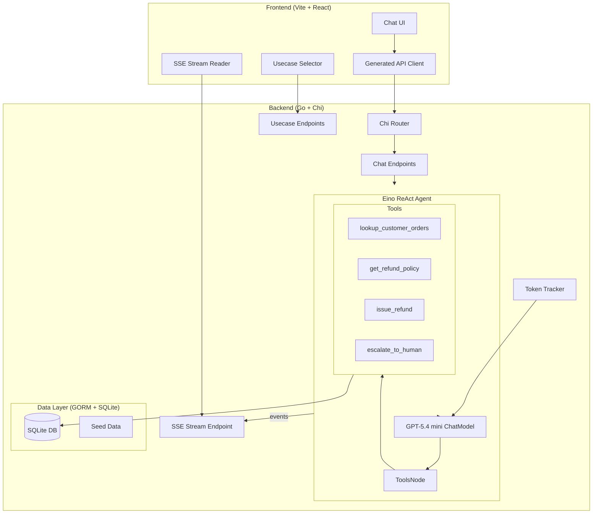
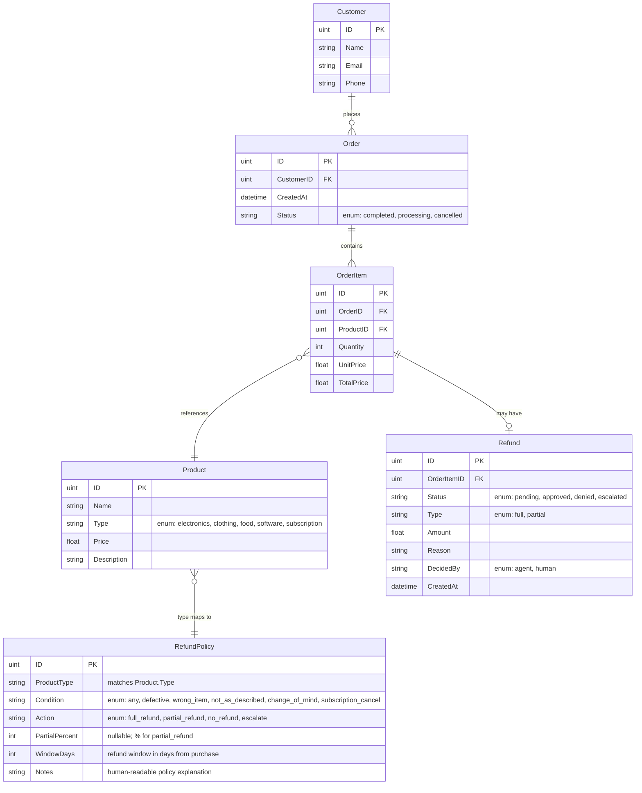
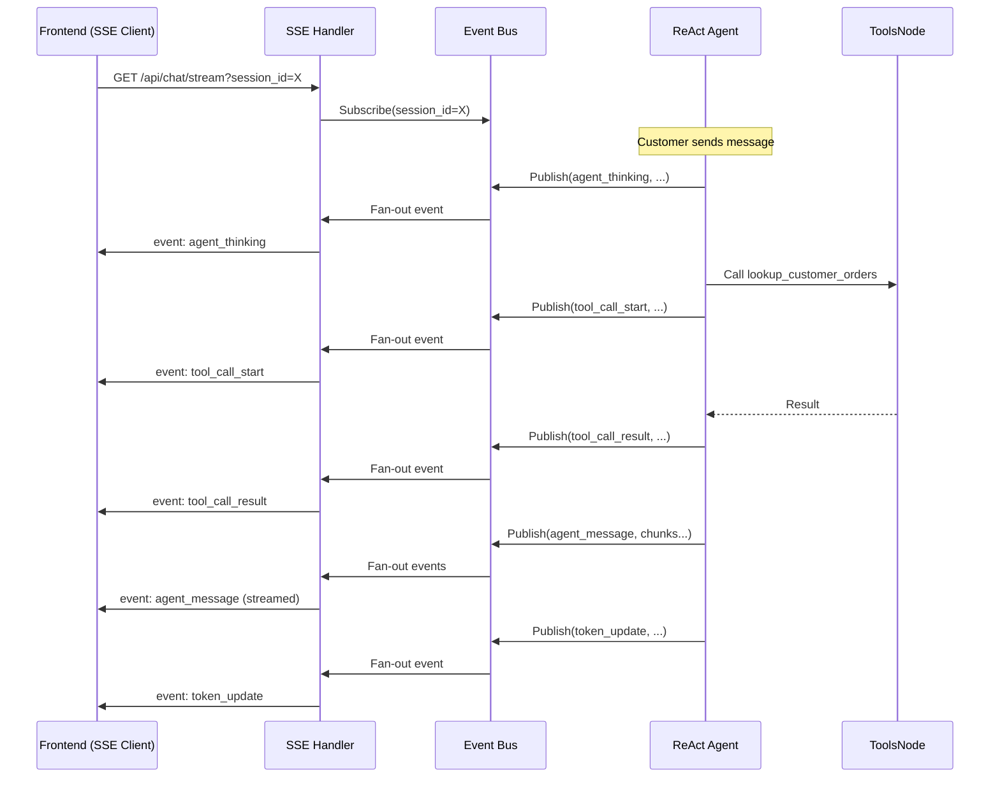
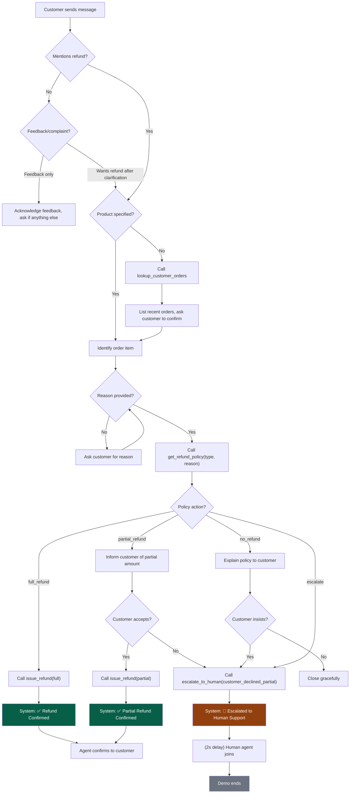
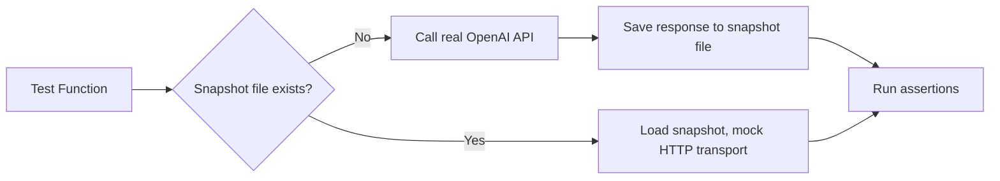

# AI Customer Support Demo

> **Goal:** Build a self-contained demo of an AI customer support agent that handles refund workflows — gathering order data, evaluating refund policies, making autonomous decisions (full/partial/deny), and escalating to human support when necessary — all visible through a rich, real-time chat interface with debug observability.

## Overview

### High-Level Architecture



### Target Folder Structure

```
empirical-proj/
├── cmd/
│   └── server/
│       └── main.go                    # Entrypoint, server bootstrap
├── internal/
│   ├── api/
│   │   ├── router.go                  # Chi router setup, middleware
│   │   ├── chat_handler.go            # POST /api/chat/message, GET /api/chat/history
│   │   ├── sse_handler.go             # GET /api/chat/stream (SSE)
│   │   ├── usecase_handler.go         # GET /api/usecases, POST /api/usecases/:id/run
│   │   └── health_handler.go          # GET /api/health
│   ├── agent/
│   │   ├── agent.go                   # Eino ReAct agent orchestration
│   │   ├── system_prompt.go           # System prompt construction
│   │   ├── tools.go                   # Tool definitions (all 4 tools)
│   │   ├── tools_lookup_orders.go     # lookup_customer_orders implementation
│   │   ├── tools_get_policy.go        # get_refund_policy implementation
│   │   ├── tools_issue_refund.go      # issue_refund implementation
│   │   └── tools_escalate.go          # escalate_to_human implementation
│   ├── chat/
│   │   ├── service.go                 # Chat session management, message persistence
│   │   ├── events.go                  # SSE event bus (fan-out to connected clients)
│   │   └── models.go                  # Message types, roles, event types
│   ├── domain/
│   │   ├── customer.go                # Customer model
│   │   ├── order.go                   # Order, OrderItem models
│   │   ├── product.go                 # Product, ProductType models
│   │   └── refund.go                  # Refund, RefundPolicy models
│   ├── db/
│   │   ├── database.go                # GORM setup, SQLite connection
│   │   └── seed.go                    # Seed data population
│   ├── token/
│   │   └── tracker.go                 # Token usage tracking, cost calculation
│   └── usecase/
│       ├── registry.go                # Usecase definitions and registry
│       └── runner.go                  # Step-by-step usecase emulation
├── internal/testutil/
│   ├── snapshot.go                    # Snapshot record/replay for OpenAI API
│   └── fixtures.go                    # Shared test fixtures
├── docs/
│   └── swagger.json                   # Generated OpenAPI spec (swaggo)
├── web/
│   ├── package.json
│   ├── vite.config.ts
│   ├── tailwind.config.ts
│   ├── tsconfig.json
│   ├── orval.config.ts                # Orval codegen config
│   ├── index.html
│   ├── src/
│   │   ├── main.tsx
│   │   ├── App.tsx
│   │   ├── api/                       # Generated API client (Orval output)
│   │   ├── components/
│   │   │   ├── ui/                    # shadcn/ui primitives
│   │   │   ├── chat/
│   │   │   │   ├── ChatContainer.tsx  # Full-screen chat layout
│   │   │   │   ├── MessageList.tsx    # Scrollable message area
│   │   │   │   ├── MessageBubble.tsx  # Customer/Agent message bubble
│   │   │   │   ├── SystemMessage.tsx  # Action confirmation cards
│   │   │   │   ├── DebugMessage.tsx   # Collapsible debug/tool-call cards
│   │   │   │   ├── HumanMessage.tsx   # Human support agent bubble
│   │   │   │   ├── ChatInput.tsx      # Message input + send
│   │   │   │   └── TokenCounter.tsx   # Discrete token count label
│   │   │   └── demo/
│   │   │       └── UsecaseSelector.tsx # Floating usecase command palette
│   │   ├── hooks/
│   │   │   ├── useChat.ts             # Chat state + SSE subscription
│   │   │   └── useUsecases.ts         # Usecase list + execution
│   │   ├── lib/
│   │   │   └── sse.ts                 # SSE client helper
│   │   └── styles/
│   │       └── index.css              # Global styles, design tokens
│   └── components.json                # shadcn/ui config
├── Makefile                           # Command palette (dev, test, codegen)
├── go.mod
├── go.sum
└── specs/
    └── S0001-customer-support-demo/
```

---

## 1. Data Model & Seed Data

### Schema



### Refund Policy Matrix

The policy engine maps `(ProductType, Condition)` → `Action`. Each row is a `RefundPolicy` record:

| Product Type   | Condition          | Action          | Partial % | Window (days) | Notes                                          |
|:---------------|:-------------------|:----------------|:----------|:--------------|:-----------------------------------------------|
| electronics    | defective          | full_refund     | —         | 30            | Full refund for defective electronics           |
| electronics    | wrong_item         | full_refund     | —         | 30            | Full refund for wrong item shipped              |
| electronics    | not_as_described   | partial_refund  | 80        | 30            | 80% refund if item doesn't match description    |
| electronics    | change_of_mind     | partial_refund  | 70        | 15            | 70% refund within 15-day window                 |
| clothing       | defective          | full_refund     | —         | 60            | Full refund for defective clothing              |
| clothing       | wrong_item         | full_refund     | —         | 60            | Full refund for wrong size/color shipped         |
| clothing       | not_as_described   | full_refund     | —         | 30            | Full refund within 30 days                      |
| clothing       | change_of_mind     | no_refund       | —         | —             | No refund for change of mind (hygiene policy)   |
| food           | defective          | full_refund     | —         | 7             | Full refund for spoiled/expired food             |
| food           | wrong_item         | full_refund     | —         | 7             | Full refund for wrong item                       |
| food           | any                | no_refund       | —         | —             | Food items are non-refundable otherwise         |
| software       | any                | escalate        | —         | —             | All software refunds require human review        |
| subscription   | subscription_cancel | partial_refund | 50        | 3             | Pro-rated 50% refund within 3 days of renewal   |
| subscription   | change_of_mind     | full_refund     | —         | 7             | Full refund within 7-day trial window            |
| subscription   | any                | no_refund       | —         | —             | No refund outside trial/renewal windows         |

### Seed Data

The seed data must support all defined test cases. Seeded on every server start into a fresh SQLite database.

**Customer** (always present, mocked as "current user"):

| ID | Name           | Email                    | Phone          |
|:---|:---------------|:-------------------------|:---------------|
| 1  | Sarah Mitchell | sarah.mitchell@email.com | (555) 123-4567 |

**Products:**

| ID | Name                      | Type         | Price    |
|:---|:--------------------------|:-------------|:---------|
| 1  | Wireless Noise-Cancelling Headphones | electronics  | $149.99  |
| 2  | Premium Cotton T-Shirt    | clothing     | $34.99   |
| 3  | Organic Meal Kit Box      | food         | $59.99   |
| 4  | ProEdit Photo Suite License | software   | $199.99  |
| 5  | CloudSync Pro (Annual)    | subscription | $119.99  |
| 6  | Bluetooth Keyboard        | electronics  | $79.99   |
| 7  | Running Shoes             | clothing     | $89.99   |

**Orders** (all belonging to Customer 1, various dates for window testing):

| ID  | Date            | Status    | Items                                     |
|:----|:----------------|:----------|:------------------------------------------|
| 101 | 5 days ago      | completed | Wireless Headphones ×1, Cotton T-Shirt ×2 |
| 102 | 20 days ago     | completed | Organic Meal Kit ×1                        |
| 103 | 3 days ago      | completed | ProEdit Photo Suite ×1                     |
| 104 | 2 days ago      | completed | CloudSync Pro ×1                           |
| 105 | 10 days ago     | completed | Bluetooth Keyboard ×1, Running Shoes ×1   |

---

## 2. Agent Architecture

### Eino ReAct Agent

The agent uses cloudwego/eino's **ReAct pattern**: an LLM reasoning loop with tool execution via `ToolsNode`.

```go
// Pseudocode — agent construction
chatModel, _ := openai.NewChatModel(ctx, &openai.ChatModelConfig{
    APIKey: os.Getenv("OPENAI_API_KEY"),
    Model:  "gpt-5.4-mini",
})

toolsNode, _ := compose.NewToolsNode(ctx, &compose.ToolsNodeConfig{
    Tools: []tool.BaseTool{
        lookupCustomerOrders,
        getRefundPolicy,
        issueRefund,
        escalateToHuman,
    },
})

agent, _ := compose.NewGraph[string, *schema.Message]()
// Wire: START → ChatModel → ToolsNode → ChatModel (loop) → END
```

### System Prompt

The system prompt establishes the agent's identity and behavioral rules:

```
You are a customer support agent for ShopEase, a multi-category online retailer.
Your primary role is to help customers with refund requests.

CURRENT CUSTOMER: {{customer_name}} ({{customer_email}})

BEHAVIORAL RULES:
1. Be empathetic, professional, and concise.
2. When a customer mentions a refund, first identify which order/product they mean.
3. If the customer doesn't specify a product, use lookup_customer_orders to list
   their recent purchases and ask them to confirm which one.
4. Once you identify the product, ask the customer for the reason (defective,
   wrong item, not as described, change of mind, or other).
5. Use get_refund_policy to check the applicable policy for the product type
   and reason.
6. Based on the policy action:
   - full_refund: Use issue_refund to process immediately. Confirm to the customer.
   - partial_refund: Inform the customer of the partial amount and percentage.
     Ask if they accept. If yes, issue_refund. If no, escalate_to_human.
   - no_refund: Explain the policy reason. If the customer insists, escalate_to_human.
   - escalate: Use escalate_to_human with a reason. Inform the customer.
7. If you encounter any unexpected error or cannot determine the right action,
   escalate_to_human with reason "unable_to_determine".
8. If the customer is only providing feedback (no refund request), acknowledge
   their feedback warmly and ask if there's anything else you can help with.
9. NEVER fabricate order data or policy information. Always use your tools.
```

### Tool Definitions

Each tool implements `tool.InvokableTool` from eino:

#### `lookup_customer_orders`

| Property    | Value |
|:------------|:------|
| Description | Retrieves the current customer's recent orders with item details. |
| Parameters  | `limit` (int, optional, default 5): max orders to return |
| Returns     | JSON array of orders with items, dates, and product names |
| DB Query    | `SELECT orders with items WHERE customer_id = <current> ORDER BY created_at DESC LIMIT <limit>` |

#### `get_refund_policy`

| Property    | Value |
|:------------|:------|
| Description | Looks up the refund policy for a given product type and refund reason. |
| Parameters  | `product_type` (string, required), `condition` (string, required) |
| Returns     | JSON object: `{action, partial_percent, window_days, notes}` or a generic fallback if no exact match |
| DB Query    | `SELECT * FROM refund_policies WHERE product_type = ? AND condition IN (?, 'any') ORDER BY condition DESC LIMIT 1` |
| Fallback    | If no policy found, return `{action: "escalate", notes: "No policy found for this combination"}` |

#### `issue_refund`

| Property    | Value |
|:------------|:------|
| Description | Issues a refund for a specific order item. Creates a Refund record and emits a system confirmation event. |
| Parameters  | `order_item_id` (uint, required), `refund_type` (string: "full" or "partial"), `amount` (float, required), `reason` (string, required) |
| Returns     | JSON: `{refund_id, status, amount, type}` |
| Side Effect | Creates `Refund` row with `status=approved`, `decided_by=agent`. Emits a `system_confirmation` SSE event. |

#### `escalate_to_human`

| Property    | Value |
|:------------|:------|
| Description | Escalates the conversation to a human support agent. The demo fakes a human agent joining. |
| Parameters  | `reason` (string, required): why escalation is needed |
| Returns     | JSON: `{escalated: true, reason}` |
| Side Effect | Emits a `system_escalation` SSE event. After a 2-second delay, emits a fake `human_agent` message: *"Hi, I'm Alex from the support team. I've reviewed your case and I'm here to help. Let me look into this for you."* This is the demo endpoint — no further agent messages after escalation. |

### Agent Event Emission

Every tool call and agent reasoning step emits SSE events for frontend debug visibility:

| Event Type            | Payload                                     | When Emitted                            |
|:----------------------|:--------------------------------------------|:----------------------------------------|
| `agent_thinking`      | `{content: "<reasoning text>"}`             | Start of each agent reasoning step      |
| `tool_call_start`     | `{tool, arguments}`                         | Before tool execution                    |
| `tool_call_result`    | `{tool, result, duration_ms}`               | After tool execution completes           |
| `agent_message`       | `{content: "<streamed text>"}`              | Agent's response text (streamed chunks) |
| `system_confirmation` | `{action, details}`                         | Refund issued, action completed          |
| `system_escalation`   | `{reason, human_agent_name}`                | Escalation triggered                     |
| `human_message`       | `{content, agent_name}`                     | Fake human agent message                 |
| `token_update`        | `{prompt_tokens, completion_tokens, total}` | After each LLM call                     |
| `error`               | `{message}`                                 | On unexpected errors                     |

---

## 3. API Design

All endpoints are prefixed with `/api`. The server also serves the frontend static files at `/`.

### Endpoints

#### `POST /api/chat/message`

Send a customer message and trigger the agent loop.

```json
// Request
{
  "content": "I'd like a refund for my headphones",
  "session_id": "optional-uuid"
}

// Response 202 Accepted
{
  "session_id": "uuid",
  "message_id": "uuid"
}
```

The agent processes asynchronously; responses stream via SSE.

#### `GET /api/chat/stream?session_id={id}`

SSE endpoint. Streams all events for a session in real time.

```
event: agent_message
data: {"content": "I'd be happy to help"}

event: tool_call_start
data: {"tool": "lookup_customer_orders", "arguments": {"limit": 5}}

event: tool_call_result
data: {"tool": "lookup_customer_orders", "result": {...}, "duration_ms": 12}

event: token_update
data: {"prompt_tokens": 1240, "completion_tokens": 85, "total": 1325}
```

#### `GET /api/chat/history?session_id={id}`

Returns the full message history for a session.

```json
// Response 200
{
  "session_id": "uuid",
  "messages": [
    {
      "id": "uuid",
      "role": "customer",
      "content": "I'd like a refund",
      "timestamp": "2026-06-03T19:00:00Z"
    },
    {
      "id": "uuid",
      "role": "agent",
      "content": "I'd be happy to help...",
      "timestamp": "2026-06-03T19:00:02Z"
    }
  ]
}
```

#### `POST /api/chat/reset`

Resets the current session, clears message history.

```json
// Response 200
{ "session_id": "new-uuid" }
```

#### `GET /api/usecases`

Returns the list of available demo usecases.

```json
// Response 200
{
  "usecases": [
    {
      "id": "refund_with_product",
      "name": "Refund — Product Specified",
      "description": "Customer requests refund and specifies the product",
      "steps": 4
    }
  ]
}
```

#### `POST /api/usecases/{id}/run`

Starts executing a usecase. Steps are sent as customer messages at 2-second intervals. Progress events stream via the existing SSE channel.

```json
// Request
{ "session_id": "uuid" }

// Response 202 Accepted
{ "usecase_id": "refund_with_product", "session_id": "uuid" }
```

#### `GET /api/health`

```json
// Response 200
{ "status": "ok", "model": "gpt-5.4-mini" }
```

### OpenAPI Generation

Swagger annotations (`swaggo/swag`) decorate all handler functions. Generated spec is output to `docs/swagger.json`. The Orval codegen reads this file to produce the TypeScript API client.

---

## 4. SSE Event Bus

The event bus is an in-process pub/sub system — no external dependencies.



Implementation: Go channels with a `sync.Map` keyed by `session_id`. Each subscriber gets a buffered channel. On disconnect, the channel is removed.

---

## 5. Frontend Design

### Design Philosophy: AI-Native & Conversational

The UI is a **single full-screen chat interface** that feels like a premium, purpose-built AI support terminal — not a generic messaging app. The design emphasizes:

- **Dark mode** as default with a rich, deep color palette
- **Glassmorphism** on message containers and system cards
- **Smooth micro-animations** for message entry, typing indicators, and state transitions
- **Clear visual hierarchy** distinguishing message types by color, shape, and position

### Layout

```
┌──────────────────────────────────────────────────────────┐
│  ┌─ Header ──────────────────────────────────────────┐   │
│  │  ShopEase Support  ·  Session #abc123     [⌘ Demo]│   │
│  └───────────────────────────────────────────────────┘   │
│                                                          │
│  ┌─ Message Area (scrollable) ───────────────────────┐   │
│  │                                                   │   │
│  │  [LEFT]  🤖 Agent: Hello! How can I help today?   │   │
│  │                                                   │   │
│  │  [RIGHT] 👤 Customer: I want a refund for my...   │   │
│  │                                                   │   │
│  │  [LEFT]  🤖 Agent: I'd be happy to help! Let...   │   │
│  │                                                   │   │
│  │  [LEFT]  ┌─ DEBUG ─────────────────────────┐      │   │
│  │          │ 🔧 Tool: lookup_customer_orders  │      │   │
│  │          │ Args: {limit: 5}                 │      │   │
│  │          │ Result: [{order: 101, ...}]      │      │   │
│  │          │ Duration: 12ms                   │      │   │
│  │          └──────────────────────────────────┘      │   │
│  │                                                   │   │
│  │  [CENTER] ┌─ SYSTEM ───────────────────────┐      │   │
│  │           │ ✅ Refund Processed             │      │   │
│  │           │ Amount: $149.99 · Full Refund   │      │   │
│  │           │ Order #101 · Headphones         │      │   │
│  │           └─────────────────────────────────┘      │   │
│  │                                                   │   │
│  │  [LEFT]  👤 Alex (Human): Hi, I'm Alex from...    │   │
│  │                                                   │   │
│  └───────────────────────────────────────────────────┘   │
│                                                          │
│  ┌─ Input Area ──────────────────────────────────────┐   │
│  │  [Type your message...                    ] [Send]│   │
│  │                        Tokens: 1,325 · $0.0042    │   │
│  └───────────────────────────────────────────────────┘   │
└──────────────────────────────────────────────────────────┘
```

### Message Types & Visual Treatment

| Role       | Alignment | Visual Style                                                            | Icon |
|:-----------|:----------|:------------------------------------------------------------------------|:-----|
| Customer   | Right     | Solid accent-colored bubble (e.g., indigo-500), white text              | 👤   |
| Agent      | Left      | Glass-morphic bubble with subtle border, lighter text                   | 🤖   |
| Human      | Left      | Distinct warm-toned bubble (e.g., amber/orange hue), "agent" badge     | 👤   |
| System     | Center    | Card with icon (✅ ⚠️ ❌), structured content, no bubble shape          | —    |
| Debug      | Left      | Collapsible card, monospace font, muted colors, `code`-style background | 🔧   |

### System Message Cards

System messages are **not** chat bubbles. They are structured cards that span the width of the message area:

- **Refund Confirmed**: green accent, checkmark icon, shows amount/type/order details
- **Escalation Notice**: amber accent, handoff icon, shows reason and human agent name
- **Error**: red accent, warning icon, shows error message

### Debug Messages

Debug messages are **collapsible** by default (showing only the tool name and a one-line summary). When expanded, they show:

- Tool name and description
- Input arguments (formatted JSON)
- Output result (formatted JSON, truncated if large)
- Execution duration

### Usecase Selector (Demo Command Palette)

A floating overlay triggered by a button in the header (`⌘ Demo` or a beaker icon). Opens a searchable list of predefined usecases. On selection:

1. Resets the current chat session
2. Sends the first customer message automatically
3. Waits for the agent to respond
4. Sends the next customer message (2s delay after agent response)
5. Repeats until the flow concludes
6. A subtle "Demo in progress..." indicator appears in the header

During a usecase run, the chat input is disabled.

### Token Counter

A discrete label at the bottom of the chat, below the input area. Shows:
- Running token count (prompt + completion)
- Estimated cost in USD using GPT-5.4 mini pricing ($0.75/1M input, $4.50/1M output)

Updated in real time via `token_update` SSE events.

### Typing Indicator

When the agent is processing (between `agent_thinking` and final `agent_message`), a subtle animated typing indicator appears on the left side — three pulsing dots with the agent icon.

---

## 6. Chat & Agent Workflow

### Core Refund Flow



### Human Escalation (Demo Behavior)

When `escalate_to_human` is called:

1. Agent sends a final message: *"I'm connecting you with a specialist who can help further."*
2. `system_escalation` event emitted → System card rendered in UI
3. After a 2-second `time.Sleep` delay, a `human_message` event is emitted with a canned message from "Alex"
4. The chat input remains active (customer can still type), but no further agent processing occurs — the demo has reached its terminal state

### Error Handling / Mock Failure

For the test case "unexpected problem makes the AI unable to proceed":

- A **mock error flag** can be set via an environment variable (`DEMO_FORCE_ERROR=true`) or a special debug header (`X-Demo-Force-Error: true`) on the `/api/chat/message` request
- When active, the `get_refund_policy` tool returns an error: `"internal error: policy service unavailable"`
- The agent's system prompt instructs it to escalate to human on unexpected errors
- This produces the escalation flow triggered by an infrastructure failure rather than a policy decision

---

## 7. Usecase Definitions

Each usecase is a scripted sequence of customer messages. The backend stores them in-memory (no DB). The agent responds naturally to each message.

| ID                          | Name                                     | Customer Messages (in order)                                                                                                                                                                                      |
|:----------------------------|:-----------------------------------------|:------------------------------------------------------------------------------------------------------------------------------------------------------------------------------------------------------------------|
| `refund_product_specified`  | Refund — Product Specified               | 1. "I'd like a refund for the wireless headphones I bought last week" 2. "They're defective — the left earcup makes a buzzing noise"                                                                            |
| `refund_no_product`         | Refund — No Product Specified            | 1. "Hi, I need to return something for a refund" 2. "The headphones from order 101 please" 3. "They're defective"                                                                                               |
| `feedback_only`             | Feedback Only — No Refund                | 1. "I'm not happy with the meal kit I received" 2. "No, I don't need a refund. Just wanted to let you know the quality was below expectations" 3. "That's all, thanks"                                           |
| `complaint_then_refund`     | Complaint → Refund                       | 1. "The t-shirts I ordered are nothing like the pictures on your website" 2. "Yes, I'd like a refund please" 3. "They don't match the description at all"                                                       |
| `refund_denied`             | Refund Denied (Policy)                   | 1. "I want to return the t-shirt I bought" 2. "I just changed my mind about the color" 3. "Okay, I understand"                                                                                                  |
| `full_refund_auto`          | Full Refund — Auto Approved              | 1. "My headphones are broken, I need a refund" 2. "They're defective — stopped working after 2 days"                                                                                                            |
| `partial_refund_declined`   | Partial Refund — Customer Declines       | 1. "I want to return my keyboard" 2. "I just changed my mind, nothing wrong with it" 3. "No, I think I deserve a full refund" |
| `partial_refund_accepted`   | Partial Refund — Customer Accepts        | 1. "I want to return my keyboard" 2. "Changed my mind" 3. "Yes, that's fine, I'll take the partial refund"                                                                                                      |
| `escalate_by_policy`        | Escalation — Policy Requires Human       | 1. "I need a refund for the photo editing software" 2. "It crashes every time I try to export"                                                                                                                    |
| `escalate_by_error`         | Escalation — System Error (Mocked)       | 1. "I want a refund for my running shoes" 2. "They fell apart after one run" *(requires `X-Demo-Force-Error: true` header or env var)*                                                                          |
| `subscription_trial_refund` | Subscription — Trial Window Refund       | 1. "I want to cancel CloudSync Pro, I signed up 2 days ago" 2. "I just changed my mind"                                                                                                                         |
| `subscription_late_cancel`  | Subscription — Outside Window (Denied)   | 1. "Cancel my CloudSync Pro subscription and refund me" 2. "I've had it for a few months but never really used it" 3. "Fine, I understand"                                                                      |

---

## 8. Token Tracking & Cost Reporting

### Runtime Tracking

A `TokenTracker` singleton accumulates usage across the server lifetime:

```go
type TokenTracker struct {
    mu              sync.Mutex
    PromptTokens    int64
    CompletionTokens int64
    Sessions        int
}

func (t *TokenTracker) Record(prompt, completion int) {
    t.mu.Lock()
    defer t.mu.Unlock()
    t.PromptTokens += int64(prompt)
    t.CompletionTokens += int64(completion)
}

func (t *TokenTracker) Cost() float64 {
    // GPT-5.4 mini pricing
    inputCost := float64(t.PromptTokens) / 1_000_000 * 0.75
    outputCost := float64(t.CompletionTokens) / 1_000_000 * 4.50
    return inputCost + outputCost
}
```

### Shutdown Report

On `SIGINT`/`SIGTERM`, the server prints a summary to stdout before exiting:

```
══════════════════════════════════════════
  ShopEase Demo — Session Summary
──────────────────────────────────────────
  Sessions:          3
  Prompt Tokens:     12,450
  Completion Tokens: 3,210
  Total Tokens:      15,660
──────────────────────────────────────────
  Input Cost:        $0.0093
  Output Cost:       $0.0144
  Total Cost:        $0.0238
══════════════════════════════════════════
```

---

## 9. Snapshot Testing

### Philosophy

Tests must be **reproducible, fast, and cost-free** after the first run — while remaining easy to regenerate when prompt or tool logic changes.

### Mechanism



**Snapshot file location:** `internal/testutil/snapshots/<test_name>.json`

**Snapshot format:** Each file contains an ordered list of request/response pairs:

```json
[
  {
    "request": {
      "model": "gpt-5.4-mini",
      "messages": [...],
      "tools": [...]
    },
    "response": {
      "id": "chatcmpl-...",
      "choices": [...],
      "usage": {"prompt_tokens": 1200, "completion_tokens": 85}
    }
  }
]
```

### Implementation

The snapshot system works by injecting a custom `http.RoundTripper` that:

1. **Record mode** (no snapshot file): Proxies to real OpenAI, records request+response pairs
2. **Replay mode** (snapshot file exists): Matches requests sequentially, returns recorded responses

```go
// Usage in tests
func TestRefundFullAuto(t *testing.T) {
    transport := testutil.NewSnapshotTransport(t, "refund_full_auto")
    agent := setupAgentWithTransport(transport)
    
    // Run the conversation
    resp := agent.ProcessMessage(ctx, "My headphones are broken, I need a refund")
    // ... assertions ...
    
    resp = agent.ProcessMessage(ctx, "They're defective — stopped working after 2 days")
    // ... assertions on refund issuance ...
}
```

### Regenerating Snapshots

Delete the snapshot file and re-run the test with a valid `OPENAI_API_KEY`:

```bash
rm internal/testutil/snapshots/refund_full_auto.json
OPENAI_API_KEY=sk-... go test ./internal/agent/ -run TestRefundFullAuto -v
```

### Test Organization

Tests are organized by the test case scenarios defined in Section 7, with descriptive names:

```
internal/agent/
├── agent_test.go           # Test setup, helpers
├── refund_test.go          # All refund flow tests
├── escalation_test.go      # Escalation flow tests
└── feedback_test.go        # Feedback-only flow tests
```

Each test file contains:
- A `TestXxx` function per test case
- Clear `// Arrange / Act / Assert` sections
- Helper functions extracted to `agent_test.go` to avoid duplication

---

## 10. Command Palette (Makefile)

All dev operations via `make`:

```makefile
# ─── Development ───────────────────────────────────
.PHONY: dev-be
dev-be:            ## Start the Go backend (hot-reload via air)
	cd cmd/server && go run .

.PHONY: dev-fe
dev-fe:            ## Start the Vite frontend dev server
	cd web && npm run dev

.PHONY: dev
dev:               ## Start both backend and frontend concurrently
	make -j2 dev-be dev-fe

# ─── Code Generation ──────────────────────────────
.PHONY: swagger
swagger:           ## Generate OpenAPI spec from Go annotations
	swag init -g cmd/server/main.go -o docs

.PHONY: codegen
codegen: swagger   ## Generate TypeScript API client from OpenAPI spec
	cd web && npx orval

# ─── Testing ──────────────────────────────────────
.PHONY: test
test:              ## Run all Go tests (uses snapshots if available)
	go test ./... -v

.PHONY: test-refresh
test-refresh:      ## Delete all snapshots and re-record from live API
	rm -rf internal/testutil/snapshots/*.json
	OPENAI_API_KEY=$(OPENAI_API_KEY) go test ./... -v

# ─── Setup ─────────────────────────────────────────
.PHONY: setup
setup:             ## Install all dependencies
	go mod tidy
	cd web && npm install

.PHONY: install-tools
install-tools:     ## Install required Go tools
	go install github.com/swaggo/swag/cmd/swag@latest

.PHONY: help
help:              ## Show this help
	@grep -E '^[a-zA-Z_-]+:.*?## .*$$' $(MAKEFILE_LIST) | sort | \
		awk 'BEGIN {FS = ":.*?## "}; {printf "  \033[36m%-20s\033[0m %s\n", $$1, $$2}'

.DEFAULT_GOAL := help
```

---

## 11. Demo Observability

> **Note:** This is a self-contained demo — no production infrastructure. Observability is limited to token tracking and stdout logging.

### Token Cost Tracking

- **Runtime**: `TokenTracker` singleton records every OpenAI call's `usage` field
- **Frontend**: Token counter displayed at bottom of chat, updated via SSE `token_update` events
- **Shutdown**: Summary report printed to stdout (see Section 8)

### Structured Logging

All backend operations log to stdout in structured format (`slog` with JSON handler):

```json
{"level":"INFO","msg":"agent_tool_call","tool":"get_refund_policy","args":{"product_type":"electronics","condition":"defective"},"duration_ms":3}
{"level":"INFO","msg":"agent_response","session_id":"abc123","tokens":{"prompt":1200,"completion":85}}
{"level":"ERROR","msg":"openai_error","error":"rate limit exceeded","session_id":"abc123"}
```

No external monitoring, no metrics endpoints, no dashboards — stdout logs only.

---

## 12. Out of Scope

The following are explicitly excluded from this spec:

- **Authentication / Login**: No user auth. The customer is always the seeded mock user.
- **Persistent sessions across restarts**: SQLite is ephemeral; re-seeded on every start.
- **Multi-user support**: Single customer, single chat session at a time.
- **MCP / external tool servers**: All function calls are in-process Go tools.
- **Production deployment**: No Nomad, no Docker, no CI/CD.
- **Chat history persistence**: Messages live in-memory + SQLite for the session; wiped on restart.
- **Rate limiting, CORS policies, security hardening**: Demo only.
- **Mobile responsiveness**: Desktop-first; basic responsive is fine but not a requirement.
- **Internationalization**: English only.

---

## 13. Test Case Matrix

Summary of all test cases with expected outcomes:

| # | Test Case                                     | Key Tool Calls                                    | Expected Outcome                   | Usecase ID                  |
|:--|:----------------------------------------------|:--------------------------------------------------|:-----------------------------------|:----------------------------|
| 1 | Refund with product specified                 | `get_refund_policy` → `issue_refund`              | Full refund issued                 | `refund_product_specified`  |
| 2 | Refund without product specified              | `lookup_customer_orders` → `get_refund_policy` → `issue_refund` | Agent asks, then processes refund  | `refund_no_product`         |
| 3 | Feedback only, no refund                      | (none or minimal)                                 | Agent acknowledges, no refund      | `feedback_only`             |
| 4 | Complaint then refund                         | `get_refund_policy` → `issue_refund`              | Refund after clarification         | `complaint_then_refund`     |
| 5 | Refund denied by policy                       | `get_refund_policy`                               | Agent explains no-refund policy    | `refund_denied`             |
| 6 | Full refund auto-approved                     | `get_refund_policy` → `issue_refund`              | System confirmation card           | `full_refund_auto`          |
| 7 | Partial refund declined by customer           | `get_refund_policy` → `escalate_to_human`         | Escalation after customer refuses  | `partial_refund_declined`   |
| 8 | Partial refund accepted                       | `get_refund_policy` → `issue_refund`              | Partial refund system confirmation | `partial_refund_accepted`   |
| 9 | Escalation by policy (software)               | `get_refund_policy` → `escalate_to_human`         | Immediate escalation               | `escalate_by_policy`        |
| 10| Escalation by system error                    | `get_refund_policy` (error) → `escalate_to_human` | Error-triggered escalation         | `escalate_by_error`         |
| 11| Subscription trial refund                     | `get_refund_policy` → `issue_refund`              | Full refund within trial window    | `subscription_trial_refund` |
| 12| Subscription outside window                   | `get_refund_policy`                               | No refund, agent explains policy   | `subscription_late_cancel`  |
